# free-tier-abuse-public
Some screenshots of a pretty spiffy architecture project that takes advantage of the generosity of Jeff Bezos

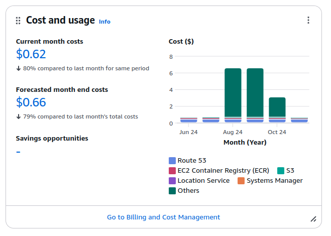

Pretty cheap, right?

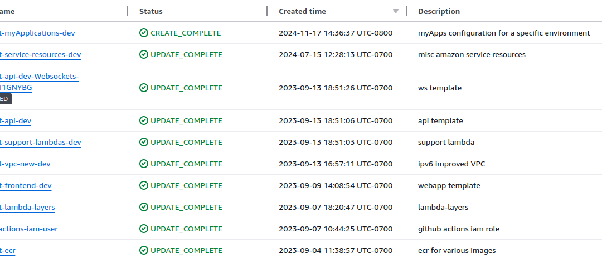

10 stacks but very easy to deploy.  All done through ci/cd or a Makefile target

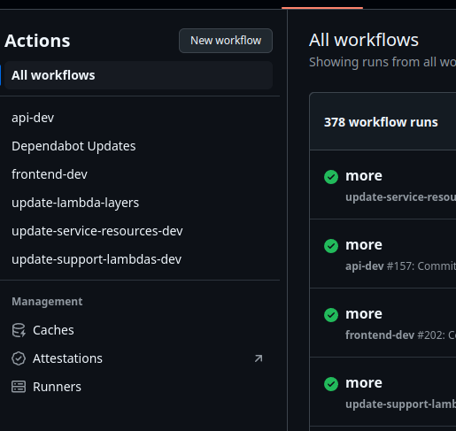

Github actions, also cheap.  1,000 minutes free per month
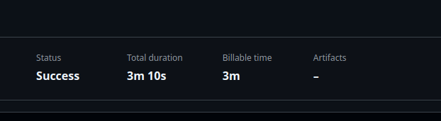

Esp when ur fast...

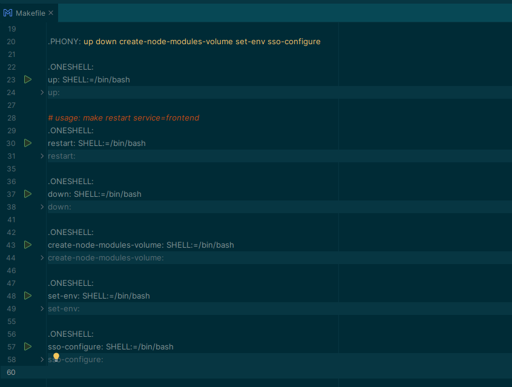

Local development starts in top level, nice makefile for easy autocomplete.  Type ```make up``` to get started after logging in to AWS via sso

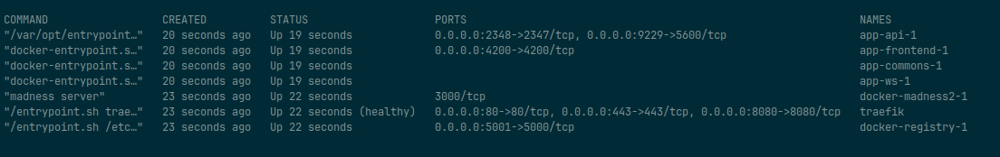

All dockerized for easy local development.  Traefik does the routing via docker-compose params

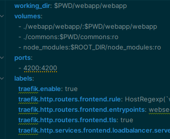

Shots from a compose file

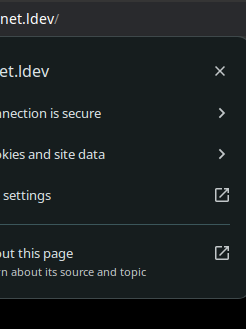

SSL for local development.  Does some magic with some local DNS and some local ca generation scripts/traefik
Makes working on service workers easy


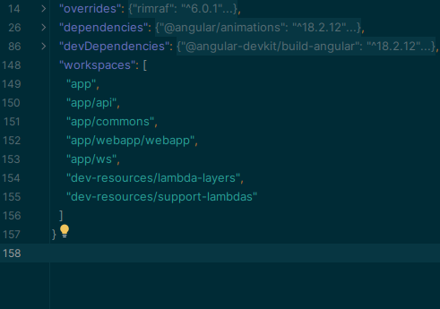

Using some node workspace stuff to make dep management tolerable


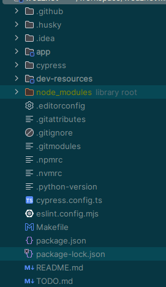

Pretty neat top level.  Rarely have to leave it.  Workspaces + good makefile discipline

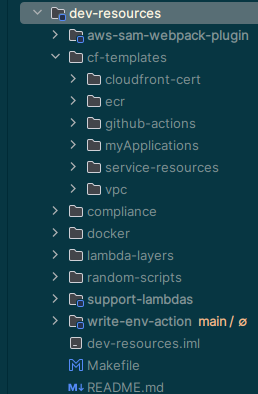

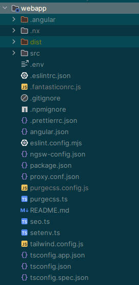

A Very beefy angular frontend with all the bells and whistles.  Like, all of them.  ALL of the bells and whistles.  All of them.

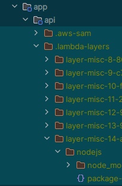

Hot reloading, Typescript and layers make for a fast dev experience.  Lots of custom dockerized SAM nonsense.

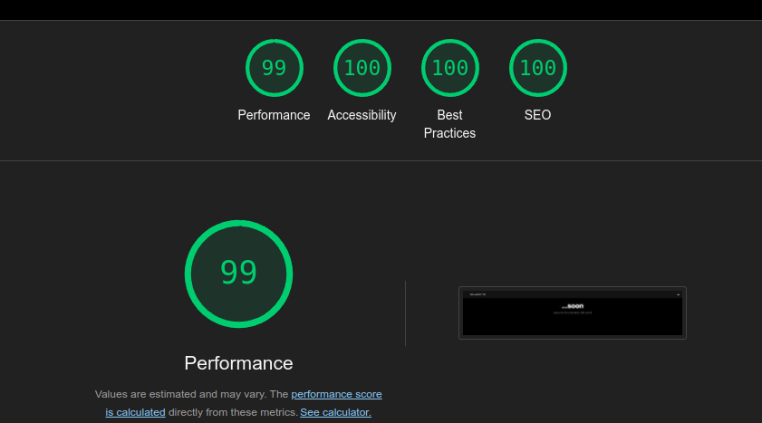
*Note -- its only 99% there because im too lazy to turn off my browser plugins, and they make it not 100.  It actually is 100%.


Just a bunch of over-engineered slop!  But it doesnt cost a fortune!
